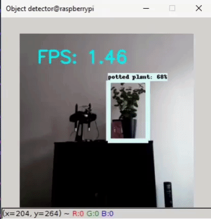

# Get a notification on Telegram when a person is present
Get a notification on Telegram when intruder is in a room, using Tensorflow/OpenCV/Raspberry Pi3/Telegram

As soon as a person is identified in the neural-net, you'll get a notice on the Telegram app on your phone!

# For this to work you need to install the following:
- Tensorflow
- OpenCV
- Telepot

You also need to setup a account on Telegram and create a bot, afterwards just insert your CHAT_ID in the script and you can easily send notifications to your Telegramapp if you have notifications activated :-)

